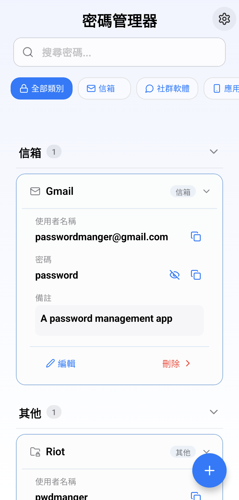
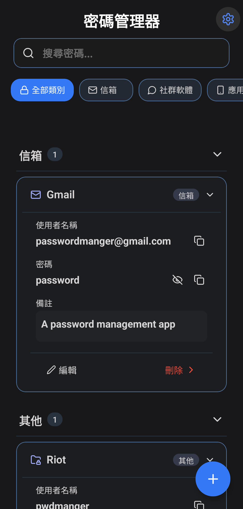
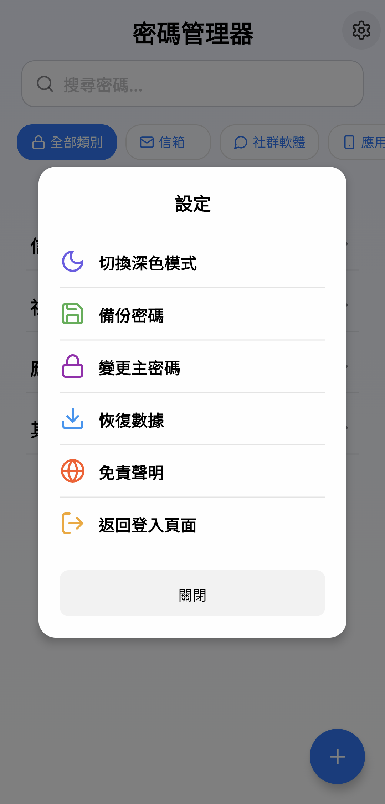

# 🔐 PasswordManager

<div align="center">


**現代化的密碼管理器，為您的數位生活提供安全保護**

[](https://apps.apple.com)
[](https://play.google.com)

</div>

---

## ✨ 特色功能

### 🔒 安全防護
- **生物辨識登入** - Face ID / Touch ID / 指紋辨識
- **端到端加密** - 使用 AES-256 加密演算法
- **安全儲存** - 本地加密儲存，資料永不外流
- **自動鎖定** - 閒置自動鎖定保護

### 📱 現代化介面
- **iOS 設計語言** - 以Apple Human Interface Guidelines 為基底去設計
- **流暢動畫** - 流暢操作體驗
- **深色模式** - 支援系統深色模式切換
- **自適應佈局** - 完美支援各種螢幕尺寸

### 🚀 強大功能
- **密碼生成器** - 智能密碼強度檢測
- **分類管理** - 自定義分類標籤
- **搜尋功能** - 快速找到所需密碼
- **備份還原** - 安全資料備份與還原
- **匯入匯出** - 支援多種格式資料轉移

### 🌍 國際化
- **多語言支援** - 繁體中文、簡體中文、English
- **本地化介面** - 完整的地區設定支援

---

## 🛠 技術架構

### 核心技術
- **React Native 0.76.9** - 跨平台開發框架
- **Expo SDK 52** - 快速開發工具鏈
- **TypeScript** - 型別安全的 JavaScript
- **Expo Router** - 檔案系統路由

### 安全技術
- **Crypto-JS** - 密碼學加密函式庫
- **Expo SecureStore** - 安全金鑰儲存
- **Expo Local Authentication** - 生物辨識認證
- **React Native Biometrics** - 進階生物辨識

### 資料儲存
- **Expo SQLite** - 本地資料庫
- **AsyncStorage** - 非敏感資料快取
- **Expo File System** - 檔案系統操作

### UI/UX 框架
- **React Native Reanimated** - 流暢動畫
- **React Native Gesture Handler** - 手勢操作
- **Expo Blur** - 毛玻璃效果
- **Lucide React Native** - 現代化圖示

---

## 📦 安裝與執行

### 環境需求
- Node.js 18.0+
- npm 或 yarn
- Expo CLI
- iOS Simulator (macOS) 或 Android Studio

### 快速開始

```bash
# 1. 克隆專案
git clone https://github.com/your-username/PasswordManager.git
cd PasswordManager

# 2. 安裝依賴
npm install

# 3. 啟動開發伺服器
npm start

# 4. 在模擬器或實機上執行
npm run ios     # iOS
npm run android # Android
```

### 開發指令

```bash
npm start       # 啟動 Expo 開發伺服器
npm run ios     # 在 iOS 模擬器執行
npm run android # 在 Android 模擬器執行
npm run web     # 在網頁瀏覽器執行
npm test        # 執行測試
npm run lint    # 程式碼檢查
```

---

## 🔧 專案結構

```
PasswordManager/
├── app/                    # Expo Router 頁面
│   ├── (tabs)/            # 標籤頁面
│   ├── modal.tsx          # 模態視窗
│   └── _layout.tsx        # 根佈局
├── src/                   # 原始碼
│   ├── components/        # 可重用元件
│   ├── hooks/            # 自定義 Hooks
│   ├── constants/        # 常數定義
│   └── utils/            # 工具函數
├── assets/               # 靜態資源
│   ├── images/          # 圖片資源
│   └── fonts/           # 字體檔案
├── android/             # Android 原生程式碼
├── ios/                 # iOS 原生程式碼
└── scripts/             # 建置腳本
```

---

## 🔐 安全架構

### 加密流程
1. **主密碼加密** - 使用 PBKDF2 衍生金鑰
2. **資料加密** - AES-256-GCM 對稱加密
3. **金鑰管理** - SecureStore 安全儲存
4. **生物辨識** - 本地認證，無網路傳輸

### 資料保護
- 所有敏感資料本地加密儲存
- 金鑰永不離開裝置
- 支援安全刪除功能
- 定期安全檢查提醒

---

## 📱 螢幕截圖

<div align="center">

| 主畫面(白) | 主畫面(黑) | 新增密碼 | 設定 |
|:---:|:---:|:---:|:---:|
|  |  |  |  |

</div>

---

## 🚀 效能優化

### 渲染優化
- React Native Reanimated 硬體加速
- 虛擬化列表渲染
- 圖片懶載入
- 記憶體使用優化

### 啟動速度
- 程式碼分割
- 資源預載入
- 快取策略優化
- 背景處理

---

## 🧪 測試

```bash
# 執行所有測試
npm test

# 執行特定測試
npm test -- --testNamePattern="Password"

# 生成測試覆蓋率報告
npm test -- --coverage
```

---

## 📄 授權條款

本專案採用 MIT 授權條款 - 詳見 [LICENSE](LICENSE) 檔案

---

## 🤝 貢獻指南

我們歡迎所有形式的貢獻！(建議不要，因為我是新手)

1. Fork 本專案
2. 建立功能分支 (`git checkout -b feature/AmazingFeature`)
3. 提交變更 (`git commit -m 'Add some AmazingFeature'`)
4. 推送到分支 (`git push origin feature/AmazingFeature`)
5. 開啟 Pull Request

---

## 📞 聯絡資訊

- **開發者**: sheeppy
- **DC**: sheeppy.
- **Email**: sheeppy2313131@gmail.com
- **GitHub**: [sheeppyYU](https://github.com/sheeppyYU)

---

<div align="center">

**⭐ 如果這個專案對您有幫助，請給我們一個星標！**

Made with ❤️ by [sheeppy](https://github.com/your-username)

</div>
